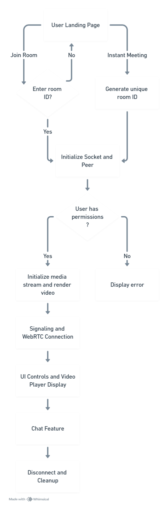

# CU-Meet (In Progress)

CU-Meet is a seamless video conferencing platform currently in development. It is designed for effortless connection, collaboration, and communication. Whether you're meeting friends or collaborating with colleagues, CU-Meet aims to provide a user-friendly experience tailored to all your video conferencing needs.

## Flowchart

  

---

## Project Status

**In Progress:** The project is actively being developed, and features are being added continuously. Some functionalities may be incomplete or subject to change.

## Technologies Used

- **Next.js:** A React framework for building server-side rendered applications.
- **Socket.io:** For real-time, bidirectional communication between clients and the server.
- **Peer.js:** Simplifies WebRTC peer-to-peer connections for video and audio streaming.
- **WebRTC:** Enables real-time communication capabilities in web applications.

## Planned Features

- **User-Friendly Interface:** Intuitive design for easy navigation and usage.
- **Join and Create Rooms:** Quick access to join existing rooms or create new ones.
- **Responsive Design:** Optimized for various screen sizes, ensuring a great experience on both desktop and mobile devices.
- **Customizable Backgrounds:** Enhance your meetings with customizable background options.
